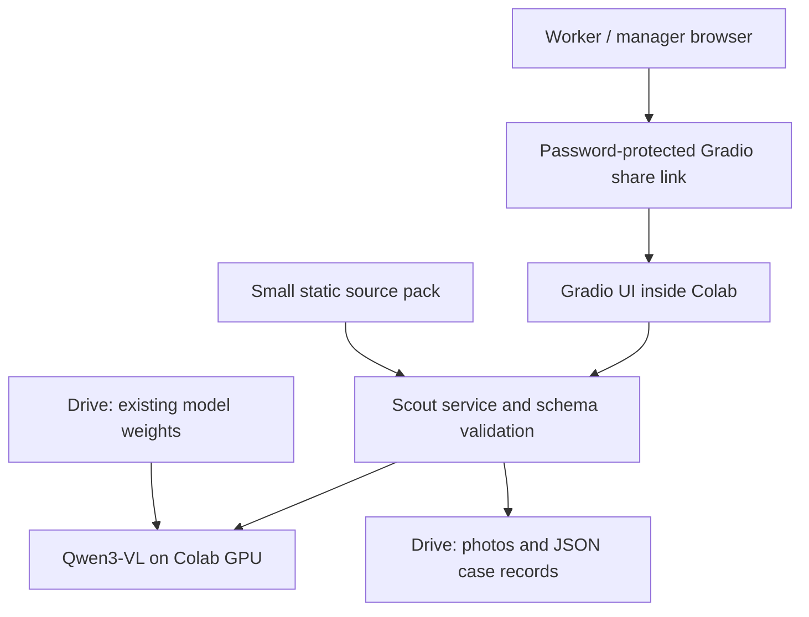

# Architecture and decisions

## Why these choices
- Gradio keeps the UI and Python model in one process with direct function calls. No backend URL synchronization is required.
- Qwen3-VL-4B-Instruct reuses the user's existing model download. Standard weights load in NF4 with float16 compute; existing quantization metadata is respected. Actual T4 behavior remains a live acceptance check.
- Complete weight shards are validated before loading. If local processor metadata is incomplete, the official Hugging Face processor is fetched; the model weights remain local to Drive.
- A single inference queue and model lock avoid overlapping GPU jobs. Cases use atomic JSON replacement under a process lock; this is a single-runtime prototype, not a distributed database.
- Photos are resized and saved without original metadata. Only selected image outputs are returned through Gradio; the entire Drive mount is never exposed as an allowed path.
- A small project-authored reference pack is embedded in each prompt. This is context injection, not semantic retrieval or fine-tuning. Source IDs are checked against an allowlist; factual grounding still needs human evaluation.
- HTML escapes worker and model text. Schema validation rejects malformed outputs and invented source IDs. Prompt instructions discourage diagnosis/prescriptions; semantic compliance is not guaranteed.

## Case lifecycle
Save evidence -> pending -> ready or unavailable. Success appends timestamp, answers, model name, latency and analysis. Failure preserves all successful revisions. Human review changes workflow status; a new successful analysis reopens the case. A failed retry shows the last successful revision explicitly as previous.

## Operational boundary
Optional `USE_DRIVE = False` skips Drive authorization and downloads the official public Qwen model using Hugging Face snapshot_download. Model and case files stay under `/content/HapusScout` and are temporary. A visible UI notice identifies this mode. Default Drive architecture and presentation remain unchanged; disclose temporary storage if demonstrating the alternate mode.

One shared demo login, no role-based permissions. Anyone with the login can see all demonstration cases. The share link is temporary and stops working when its underlying runtime stops. Drive case storage persists independently. Model loading and a public share link need network access. Model files are never committed.

## Reproducibility
Gradio and Transformers are pinned. Supporting library ranges are constrained; Colab supplies its GPU torch stack. The notebook fetches main using a fast-forward-only update. For submission, record the Git commit and freeze changes at the challenge deadline.
